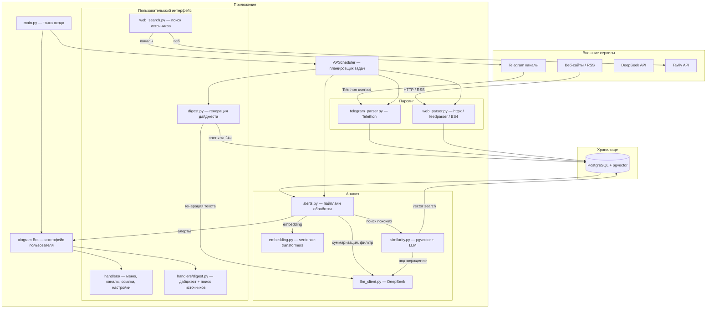
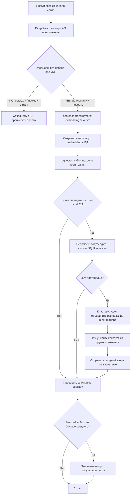
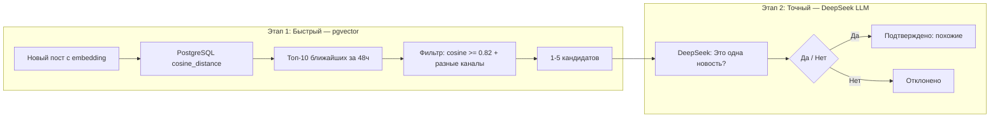
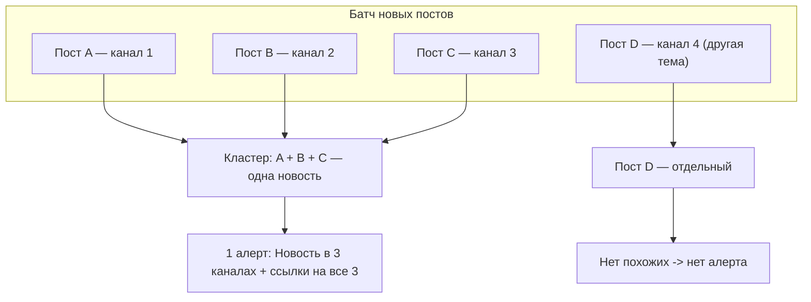
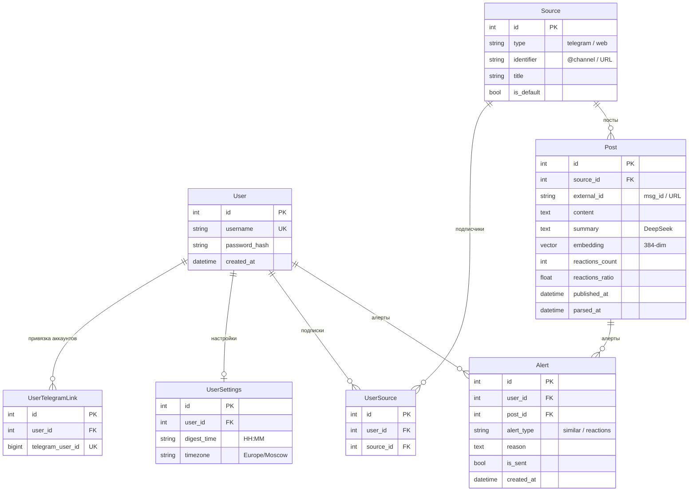
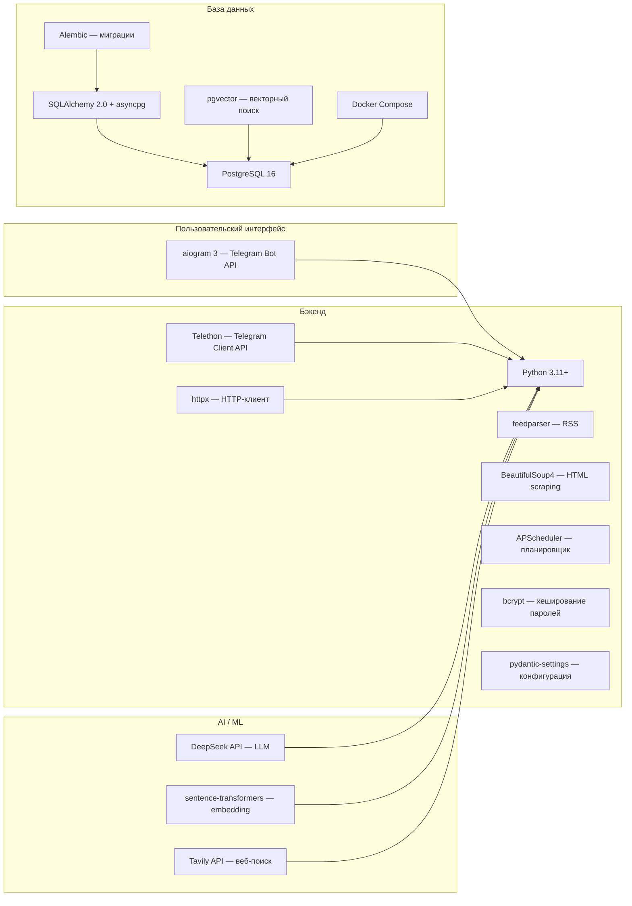
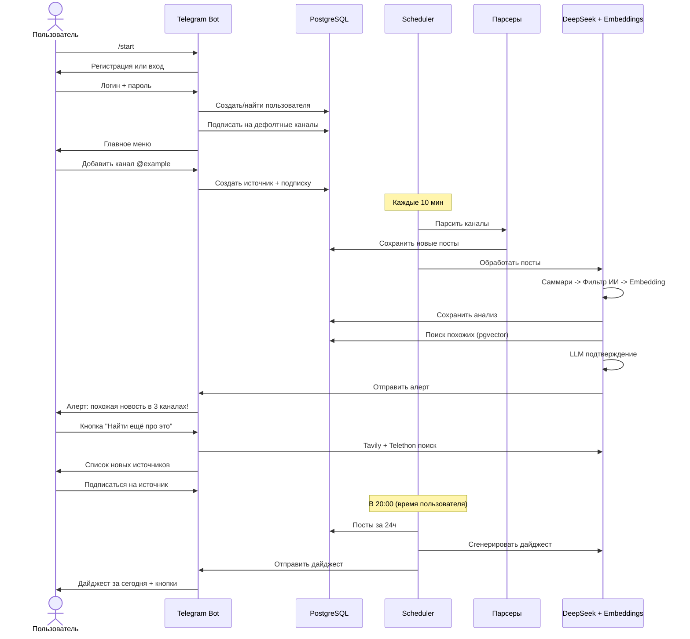
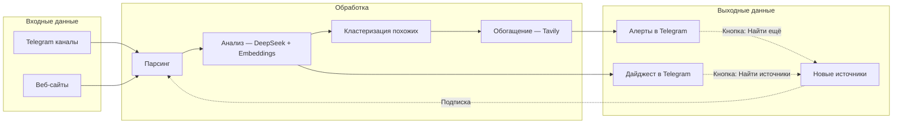

# Архитектура проекта: Telegram AI Channel Parser

## Общее описание

Бот автоматически собирает новости из Telegram-каналов и веб-сайтов, анализирует их с помощью ИИ, фильтрует рекламу/офтоп, находит похожие новости из разных источников и отправляет пользователю алерты и ежедневные дайджесты.

---

## Общая архитектура системы

---

## Пайплайн обработки постов

Каждые 10 минут (Telegram) и 30 минут (веб) запускается парсинг. Новые посты проходят через следующий пайплайн:

---

## Система сравнения постов (двухэтапная)

Сравнение работает в два этапа для оптимального баланса скорости и точности:

**Зачем два этапа?**
- **pgvector** (Этап 1) — математическое сравнение векторов, работает за миллисекунды. Отсеивает 99% постов. Но может давать ложные срабатывания (два текста "про OpenAI" не обязательно про одно событие).
- **DeepSeek** (Этап 2) — понимает смысл текста и может отличить "OpenAI запускает рекламу" от "OpenAI выпустила новую модель". Но дорогой и медленный (1-2 сек на вызов), поэтому используется только для 1-5 кандидатов.

---

## Кластеризация алертов

Если одна новость найдена в 3+ каналах за один скан, отправляется один сводный алерт:

---

## Схема базы данных

---

## Стек технологий

### Что делает каждая технология

| Технология | Роль | Почему выбрана |
|---|---|---|
| **aiogram 3** | Telegram Bot API — интерфейс пользователя | Асинхронный, современный, FSM из коробки |
| **Telethon** | Telegram Client API — парсинг каналов | Читает посты, реакции, ищет каналы (userbot) |
| **PostgreSQL + pgvector** | Хранение данных + векторный поиск | Одна БД для всего: данные + cosine similarity |
| **SQLAlchemy 2.0 + asyncpg** | ORM + async драйвер | Типизированные модели, async/await |
| **Alembic** | Миграции БД | Версионирование схемы базы |
| **DeepSeek API** | LLM для анализа текста | Суммаризация, сравнение, фильтрация, дайджест |
| **sentence-transformers** | Локальные embeddings (all-MiniLM-L6-v2) | Быстро, бесплатно, 384-dim вектор |
| **Tavily API** | Веб-поиск | Поиск контекста для алертов, новых источников |
| **APScheduler** | Планировщик задач | Периодический парсинг, отправка дайджестов |
| **httpx + feedparser + BS4** | Парсинг веб-сайтов | RSS-ленты + fallback на HTML scraping |
| **bcrypt** | Хеширование паролей | Безопасное хранение паролей пользователей |
| **Docker Compose** | Контейнеризация PostgreSQL | Простой запуск БД одной командой |

---

## Жизненный цикл пользователя

---

## Фильтрация контента

Система фильтрации работает на двух уровнях:

```mermaid
flowchart TD
    subgraph level1 [Уровень 1: LLM-фильтр — при обработке постов]
        NEW_POST[Новый пост] --> SUMMARY[DeepSeek: саммари]
        SUMMARY --> LLM_FILTER["DeepSeek: YES/NO — это ИИ-новость?"]
        LLM_FILTER -->|YES| PASS1[Проходит в алерты]
        LLM_FILTER -->|NO: реклама, промо, курсы, вакансии| SKIP1[Пропускается]
    end

    subgraph level2 [Уровень 2: Keyword-фильтр — при генерации дайджеста]
        DIGEST_POSTS[Посты для дайджеста] --> KW_FILTER["Быстрая проверка: ключевые слова ИИ"]
        KW_FILTER -->|Содержит: ai, gpt, нейросет...| PASS2[Включается в дайджест]
        KW_FILTER -->|Не содержит| SKIP2[Не включается]
    end

    subgraph level3 [Уровень 3: Keyword-фильтр — для Tavily результатов]
        TAVILY_RES[Результаты Tavily] --> KW_FILTER2["Проверка title + content на ИИ-слова"]
        KW_FILTER2 -->|Релевантно| PASS3[Показать пользователю]
        KW_FILTER2 -->|Не релевантно| SKIP3[Отбросить]
    end
```

**Почему два подхода?**
- **LLM-фильтр** — точный, понимает контекст ("продажа курсов по нейросетям" = реклама). Но медленный (1-2 сек). Используется при обработке постов (раз в 10-30 мин, до 30 постов).
- **Keyword-фильтр** — мгновенный, но грубый. Используется там, где важна скорость: генерация дайджеста (должна занимать секунды, не минуты) и фильтрация результатов Tavily.

---

## Расписание задач

| Задача | Интервал | Что делает |
|---|---|---|
| `task_parse_telegram` | Каждые 10 мин | Парсит все Telegram-каналы через Telethon, сохраняет новые посты, запускает обработку |
| `task_parse_web` | Каждые 30 мин | Парсит веб-источники (RSS/HTML), сохраняет новые посты, запускает обработку |
| `task_send_digests` | Каждую минуту | Проверяет, совпадает ли текущее время с `digest_time` пользователя, генерирует и отправляет дайджест |

---

## Потоки данных

